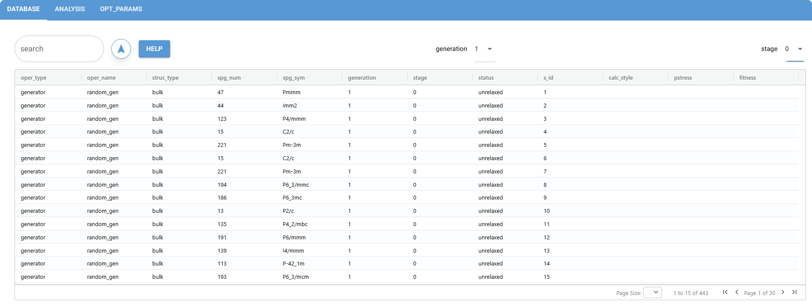

Quick start
###########

This is a quick start guide for structure prediction using AESP, through which you can quickly understand the paradigm 
cycle that AESP operates in and apply it to your projects.

Task
----

Master the Paradigm Cycle for using AESP and learn how to apply it to using AESP with a complete case study.

By the end of this tutorial, you will be able to:

* Preparation of input files for AESP
* Familiarity with the structure prediction process of AESP

Work through this tutorial. It will take you 20 minutes, max!

Background
----------

In this tutorial, we will take the aluminum metal (Al) as an example to provide a detailed 
introduction to the training and application of the AESP. Also for demonstration purposes, 
we use the effective medium theory (EMT) in `ASE <https://wiki.fysik.dtu.dk/ase/>`_ for 
structural relaxation. AESP is a software tool that employs adaptive evolutionary algorithm for structure prediction. 

Practice
--------

Preparing the input file
========================

The input file is in json format and named std-bulk.json.

.. code:: console

    {
        "dflow_config" : {
            "mode" : "debug"
        },
        "aesp_config" : {
            "type" : "std-sp",
            "opt_params" : {
                "generation" : {
                    "adaptive" : {}
                },
                "population" : {
                    "adaptive" : {}
                },
                "operator" : {
                    "type" : "bulk",
                    "generator" : {
                        "random_gen_params" : {
                            "composition" : {"Al": 8}
                        }
                    },
                    "mutation" : {
                        "strain_mut_params" : {},
                        "permutation_mut_params" : {},
                        "ripple_mut_params" : {}
                    },
                    "crossover" : {
                        "plane_cross_params" : {},
                        "sphere_cross_params" : {},
                        "cylinder_cross_params" : {}
                    },
                    "adaptive" : {},
                    "hard_constrains" : {
                        "tol_matrix" : {}
                    }
                },
                "cvg_criterion" : {}
            },
            "calc_stages" : [
                {
                    "type" : "emt",
                    "inputs_config" : {},
                    "run_config" : {}
                }
            ],
            "step_configs" : {}
        }
    }

At this point, we type ``aesp submit std-buld.json`` in the terminal to submit the task, and you can see the output of the terminal

.. code:: console

    $ aesp submit std-buld.json
        _         _____      ____       ____  
       / \       | ____|    / ___|     |  _ \ 
      / _ \      |  _|      \___ \     | |_) |
     / ___ \     | |___      ___) |    |  __/ 
    /_/   \_\    |_____|    |____/     |_|    
                                          
    v2025.10.1

    *AESP* 2025-05-12 10:10 [INFO]: Input file being checked for correctness
    *AESP* 2025-05-12 10:10 [INFO]: The complete input file will be written to input-std-bulk.json
    *AESP* 2025-05-12 10:10 [INFO]: The structure prediction is about to start
    *AESP* 2025-05-12 10:10 [INFO]: Structure prediction (Standard)
    Workflow is running locally (ID: std-sp-szvl6)    

However, this submission is not very convenient. For a large task, the computation can take up 
to several weeks, so we can submit it to run in the background. Use the ``nohup`` command that 
comes with linux, which is ``nohup aesp submit std-bulk.json > calc.log 2>&1 &``

.. code:: console

    $ nohup aesp submit std-bulk.json > calc.log 2>&1 &

    [1] 136412

    $ ls

    calc.log  input-std-bulk.json  std-bulk.json  std-sp-szvl6  upload

At this point, we can check the status of the task by using the ``status`` command
, and we can also use the ``watch`` command to monitor the status in real time.

.. code:: console

    $ aesp status std-bulk.json std-sp-szvl6/

    ...
    Mode : std-sp
    Workflow : Running
    Current step : relax-run--g1-s1-0 Running

    $ watch -n 60 aesp status std-bulk.json std-sp-szvl6/
    
    ...
    Mode : std-sp
    Workflow : Succeeded
    Current step : scheduler-gen--g10 Succeeded

When Workflow shows Succeeded it means that the workflow has completed 
successfully, so the results of the calculation can be further processed with 
the ``analysis`` command.

.. code:: console

    $ aesp analysis std-bulk.json std-sp-szvl6/

    ...
    *AESP* 2025-01-24 21:40 [INFO]: Input file being checked for correctness
    *AESP* 2025-01-24 21:40 [INFO]: The complete input file will be written to input-std-bulk.json
    *AESP* 2025-01-24 21:40 [INFO]: The output results are being analyzed
    ...

    $ ls
    calc.log  input-std-bulk.json  results  std-bulk.json  std-sp-szvl6  upload

At this point, the folder has an additional results folder, which holds the 
structures (unrelaxed and relaxed) obtained from the inclusion of the predictions
, a summary of the structure predictions (summary), and a plot of the parameter 
changes (html).

On the other hand, we can also analyze the results in a more convenient way, 
namely visualization

.. code:: console

    $ aesp gui

    ...
    NiceGUI ready to go on http://localhost:8080, http://172.17.0.1:8080, http://172.23.26.105:8080, http://192.168.122.1:8080, http://192.168.123.170:8080, http://192.168.193.42:8080, and http://192.168.49.1:8080
    NiceGUI is on air at https://asia-south.on-air.io/devices/0u9iuaH0/

The top one is the local link and the bottom one is the global link. Open the 
link to see a visualization of the page

Tap into each piece of data to also get a visualization and specific information 
about the structure

.. image:: ./_static/gui-2.png